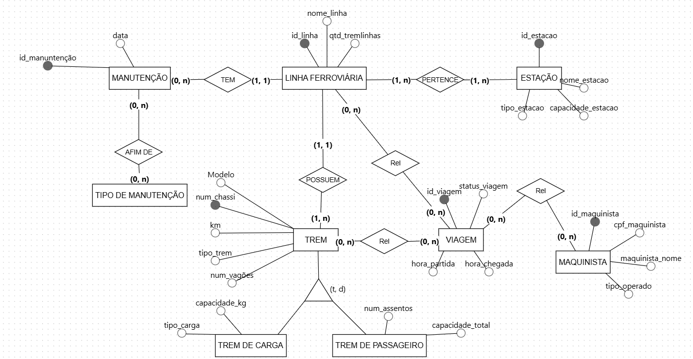

# DBproject
[](https://deepwiki.com/JoaoPRamos10/DBproject)

## Equipe
Caio Porto (2024033228111) Eduarda Carolline (202403322781), João Augusto (20243322919), João Pedro Prosini(202403322714) e Rhauan Rafael (202403322)

## Tema
**Sistema de Linhas Ferroviárias**

## Explicação do Projeto
Este projeto tem como objetivo modelar um banco de dados para gerenciar informações relacionadas a linhas ferroviárias, estações, trens, maquinistas, viagens, e seus respectivos relacionamentos. A estrutura do banco de dados busca atender às necessidades de controle e operação de uma rede ferroviária, garantindo uma organização eficiente das informações.

## Funcionalidades
*   **Cadastro de Linhas Ferroviárias:** Armazenamento de informações como nome, tipo de transporte (carga, passageiros, misto) e distância.
*   **Cadastro de Estações:** Informações como nome, localização, capacidade de atendimento e serviços oferecidos.
*   **Cadastro de Trens:** Dados como modelo, capacidade, ano de fabricação e tipo de serviço.
*   **Cadastro de Maquinistas:** Controle dos maquinistas responsáveis por diferentes linhas ferroviárias.
*   **Registro de Viagens:** Controle de partidas, chegadas, status, e qual maquinista e trem estão alocados para cada viagem.
*   **Relacionamento entre Entidades:** Conexões entre linhas, estações, trens e maquinistas.
*   **Atributos Multivalorados:** Tipos de serviços nas estações e nos trens.
*   **Generalização e Especialização:** Subtipos de trens como Trem de Passageiro e Trem de Carga.

## Estrutura do Banco de Dados
### Entidades Principais
*   Linha Ferroviária
*   Estação
*   Trem
*   Maquinista
*   Manutenção
*   Tipo de Manutenção
*   Viagem

### Entidades Secundarias
*   Trem de Carga
*   Trem de Passageiro

### Relacionamentos
*   Uma linha ferroviária pode passar por várias estações.
*   Uma linha ferroviária pode ter vários trens.
*   Uma estação pode oferecer vários serviços.
*   Uma viagem é operada por um maquinista e utiliza um trem em uma linha específica.

### Generalização/Especialização
A entidade Trem pode ser especializada em Trem de Passageiro e Trem de Carga.

## Modelo de Dados
* **Linha Ferroviária:** id_linha (PK), nome_linha, qtd_tremlinha
* **Estação:** id_estacao (PK), nome_estacao, capacidade_estacao, tipo_estacao
* **Manutenção:** id_manutenção (PK), data
* **Maquinista:** maquinista_id (PK), maquinista_cpf, maquinista_nome, tipo_operado
* **Trem (Generalização):** num_chassi (PK), Modelo, km, tipo_trem, num_vagoes
* **Trem de Carga (Especialização):** (Herda de Trem) capacidade_kg, tipo_carga
* **Trem de Passageiro (Especialização):** (Herda de Trem) num_assentos, capacidade_total
* **Viagem:** id_viagem (PK), hora_partida, hora_chegada, status_viagem, fk_id_linha (FK), fk_num_chassi (FK), fk_maquinista_id (FK)

## Modelo Conceitual (DER)


## Modelo Lógico

```mermaid
erDiagram
    LINHA_FERROVIARIA {
        INT id_linha PK "id_linha (PK)"
        STRING nome_linha "nome_linha"
        INT qtd_tremlinhas "qtd_tremlinhas"
    }

    ESTACAO {
        INT id_estacao PK "id_estacao (PK)"
        STRING nome_estacao "nome_estacao"
        INT capacidade_estacao "capacidade_estacao"
        STRING tipo_estacao "tipo_estacao"
    }

    MAQUINISTA {
        INT maquinista_id PK "maquinista_id (PK)"
        STRING maquinista_cpf "maquinista_cpf (UNIQUE)"
        STRING maquinista_nome "maquinista_nome"
        STRING tipo_operado "tipo_operado"
    }

    MANUTENCAO {
        INT id_manutencao PK "id_manutencao (PK)"
        DATE data "data"
        INT fk_id_linha FK "fk_id_linha (FK)"
    }

    TIPO_MANUTENCAO {
        INT id_tipo_manutencao PK "id_tipo_manutencao (PK)"
        STRING nome_tipo "nome_tipo"
        STRING descricao "descricao"
    }

    TREM {
        STRING num_chassi PK "num_chassi (PK)"
        STRING modelo "modelo"
        FLOAT km "km"
        STRING tipo_trem "tipo_trem"
        INT num_vagoes "num_vagoes"
        INT fk_id_linha FK "fk_id_linha (FK)"
    }

    TREM_DE_CARGA {
        STRING fk_num_chassi PK,FK "fk_num_chassi (PK, FK)"
        FLOAT capacidade_kg "capacidade_kg"
        STRING tipo_carga "tipo_carga"
    }

    TREM_DE_PASSAGEIRO {
        STRING fk_num_chassi PK,FK "fk_num_chassi (PK, FK)"
        INT num_assentos "num_assentos"
        INT capacidade_total "capacidade_total"
    }

    VIAGEM {
        INT id_viagem PK "id_viagem (PK)"
        DATETIME hora_partida "hora_partida"
        DATETIME hora_chegada "hora_chegada"
        STRING status_viagem "status_viagem"
        INT fk_id_linha FK "fk_id_linha (FK)"
        STRING fk_num_chassi FK "fk_num_chassi (FK)"
        INT fk_maquinista_id FK "fk_maquinista_id (FK)"
    }

    LINHA_ESTACAO {
        INT fk_id_linha PK,FK "fk_id_linha (PK, FK)"
        INT fk_id_estacao PK,FK "fk_id_estacao (PK, FK)"
    }

    MANUTENCAO_TIPO {
        INT fk_id_manutencao PK,FK "fk_id_manutencao (PK, FK)"
        INT fk_id_tipo_manutencao PK,FK "fk_id_tipo_manutencao (PK, FK)"
    }

    LINHA_FERROVIARIA ||--|{ MANUTENCAO : "TEM"
    LINHA_FERROVIARIA ||--|{ TREM : "POSSUEM"
    LINHA_FERROVIARIA }o--o{ ESTACAO : "PERTENCE (N:M)"
    LINHA_ESTACAO }o--|| LINHA_FERROVIARIA : "Resolve"
    LINHA_ESTACAO }o--|| ESTACAO : "Resolve"

    MANUTENCAO }o--o{ TIPO_MANUTENCAO : "AFIM DE (N:M)"
    MANUTENCAO_TIPO }o--|| MANUTENCAO : "Resolve"
    MANUTENCAO_TIPO }o--|| TIPO_MANUTENCAO : "Resolve"
    
    TREM ||--|{ TREM_DE_CARGA : "Especialização"
    TREM ||--|{ TREM_DE_PASSAGEIRO : "Especialização"

    LINHA_FERROVIARIA ||--|{ VIAGEM : "Contém"
    TREM ||--|{ VIAGEM : "Realiza"
    MAQUINISTA ||--|{ VIAGEM : "Opera"
