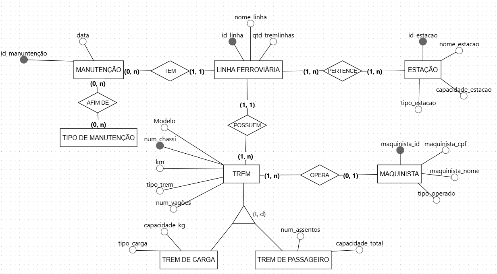

# DBproject

## Equipe
Caio Porto, Eduarda Carolline, João Augusto, João Pedro Prosini e Rhauan Rafael

## Tema
**Sistema de Linhas Ferroviárias**

## Explicação do Projeto
Este projeto tem como objetivo modelar um banco de dados para gerenciar informações relacionadas a linhas ferroviárias, estações, trens, operadores e seus respectivos relacionamentos. A estrutura do banco de dados busca atender às necessidades de controle e operação de uma rede ferroviária, garantindo uma organização eficiente das informações.

## Funcionalidades
*   **Cadastro de Linhas Ferroviárias:** Armazenamento de informações como nome, tipo de transporte (carga, passageiros, misto) e distância.
*   **Cadastro de Estações:** Informações como nome, localização, capacidade de atendimento e serviços oferecidos.
*   **Cadastro de Trens:** Dados como modelo, capacidade, ano de fabricação e tipo de serviço.
*   **Cadastro de Operadores:** Controle dos operadores responsáveis por diferentes linhas ferroviárias.
*   **Relacionamento entre Entidades:** Conexões entre linhas, estações, trens e operadores.
*   **Atributos Multivalorados:** Tipos de serviços nas estações e nos trens.
*   **Generalização e Especialização:** Subtipos de trens como Trem de Passageiro e Trem de Carga.

## Estrutura do Banco de Dados
### Entidades Principais
*   Linha Ferroviária
*   Estação
*   Trem
*   Operador

### Entidades Secundarias
*   Trem de Carga
*   Trem de Passageiro

### Relacionamentos
*   Uma linha ferroviária pode passar por várias estações.
*   Uma linha ferroviária pode ter vários trens.
*   Uma estação pode oferecer vários serviços.
*   Um operador pode ser responsável por uma ou mais linhas ferroviárias.

### Generalização/Especialização
A entidade Trem pode ser especializada em Trem de Passageiro e Trem de Carga.

## Modelo de Dados
*   **Linha Ferroviária:** ID_Linha, Nome, Distância, Tipo de Transporte
*   **Estação:** ID_Estação, Nome, Localização, Capacidade
*   **Trem:** ID_Trem, Modelo, Capacidade, Ano de Fabricação
*   **Operador:** ID_Operador, Nome, Tipo de Operação

## Modelo Conceitual (DER)

## Tecnologias Utilizadas
*   **SGBD:** MySQL, PostgreSQL ou outro SGBD relacional
*   **Ferramentas de Modelagem:** Diagramas Entidade-Relacionamento (DER)
*   **SQL:** Para criação e manipulação de tabelas
